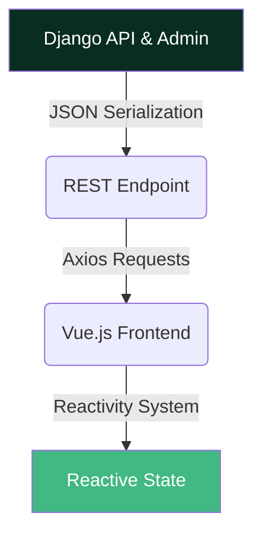

# 🌌 Continuum *(In Development)*

**Continuum** is a **power-user–oriented habit-tracking engine** built for precision, insight, and long-term behavioral optimization.
It enables granular tracking of daily routines, deep visualization of trends, and data-driven habit refinement.

Designed with **correctness, extensibility, and performance** in mind, Continuum targets both:
- 🧠 End users who want meaningful analytics
- 🛠️ Developers who value clean, scalable architecture

---

## 🧭 Project Philosophy

Continuum is built around a few core principles:

- ✅ **Correctness first** — predictable behavior and validated data
- 🧩 **Composable architecture** — modular, extensible components
- ⚡ **Performance-oriented** — reactive UI, efficient APIs
- 🧱 **Long-term maintainability** — clear contracts, strong separation of concerns

---

## 🏗️ Architecture Overview

Continuum follows a **decoupled, API-first architecture**:

- 🔌 Frontend and backend evolve independently
- 📜 Explicit, versionable data contracts
- 🔄 Stateless RESTful communication
- 🧪 Testable business logic isolated from presentation

---

## 🧰 Technology Stack

### 🧠 Backend — Core Logic Engine

Responsible for **business rules, persistence, and API exposure**.

- **🐍 Django**
  High-level Python framework enabling rapid development with a clean, pragmatic design.

- **🔗 Django REST Framework (DRF)**
  Robust API tooling: serialization, validation, authentication, and permissions.

- **🌐 CORS Headers**
  Secure cross-origin communication between frontend and backend.

- **🗃️ SQLite**
  Lightweight database for local development and testing.

- **🐘 PostgreSQL**
  Production-grade relational database chosen for reliability and scalability.

---

### 🎨 Frontend — Reactive User Interface

Focused on **speed, clarity, and interaction quality**.

- **🖖 Vue.js 3**
  Uses the Composition API (`<script setup>`) for expressive, maintainable components.

- **⚡ Vite**
  Ultra-fast dev server with near-instant Hot Module Replacement (HMR).

- **🎨 Tailwind CSS v4**
  Utility-first styling with consistent spacing, modern cards, and clean layouts.

- **📡 Axios**
  Promise-based HTTP client for API communication.

- **🧩 Lucide Vue Next**
  Elegant icon system used for habits, streaks, completion states, and analytics.

---

## 🔄 Data Flow

This ensures:
- Clear boundaries between layers
- Predictable data movement
- Independent frontend/backend evolution

---

## 🔍 Habit Insights & Correlation Analysis

Continuum uses **multiple correlation algorithms** to discover meaningful relationships between your habits:

### 📐 Correlation Methods

1. **Pearson Correlation Coefficient**
   - Measures **linear relationships** between two habits
   - Range: `-1` (perfect negative) to `+1` (perfect positive)
   - Best for: Detecting proportional relationships

2. **Spearman Rank Correlation**
   - Measures **monotonic relationships** using rank-based analysis
   - Range: `-1` (perfect negative) to `+1` (perfect positive)
   - Best for: Ordinal data and non-linear but consistent patterns

3. **Dynamic Time Warping (DTW)**
   - Measures **similarity with time shifts** and flexible alignment
   - Range: `0` (identical patterns) to `1` (completely different)
   - Best for: Detecting patterns that occur at different times or with delays

### 💡 How It Works

- Correlations are computed automatically using historical completion data
- The system calculates all three metrics for each habit pair
- **Maximum correlation** is used to identify the strongest relationship signal
- Insights are ranked by strength: `very_strong` → `strong` → `moderate` → `weak` → `very_weak`

### 🎯 Use Cases

- 📊 Identify habits that naturally cluster together
- 🧠 Understand behavioral patterns and dependencies
- 🎯 Optimize your routine by grouping correlated habits
- 🔄 Detect inverse relationships (habits that compete for time/energy)

---

## ✨ Features

- 📂 Habit categories and organization
- 📊 Statistics and trend analysis
- 🔍 **Habit Insights & Correlations** — Discover which habits you tend to do together
  - **Pearson Correlation** — Detects linear relationships between habits
  - **Spearman Rank Correlation** — Identifies monotonic relationships (handles ordinal data)
  - **Dynamic Time Warping (DTW)** — Detects time-shifted patterns and flexible alignments
- ⚙️ Admin configuration panel
- 🎯 Clean, modern UX with strong visual hierarchy
- 🔐 Token-based authentication & SSO
- 📤 Data export support (`.csv`)
- 📅 Weekly habit summaries
- 📈 Yearly retrospective analytics
- 🌍 Multi-language (i18n) support

---

## 🛣️ Roadmap

Planned milestones include:
- 🔄 Advanced streak logic
- 🧠 Insight-driven recommendations
- 🎯 Goals setting and tracking
- 📅 Summary: Add 'This week', 'This month', and customizable timeframes for deeper trend analysis
- 📈 Graph: Add unique markers or patterns to distinguish habits with similar colors for better visual clarity
- 🏷️ Graph: Per-graph card, add category and tag filters for focused analytics
- 🔍 Graph: Enable interactive tooltips and zoom/pan for detailed data exploration
- 🌙 Add dark theme logo (and light logo) for seamless theme switching
- 🏷️ Add a flexible tag system for habits, supporting search, filtering, and analytics by tag
- 🔽 In 'tracking': Add advanced filters (by category, tag, completion status), custom ordering, and quick search for efficient habit management
- ⌚ Garmin Connect integration: Import activity and health data to enrich habit tracking and analytics
---

## 🚀 Installation

Installation will be provided via **Docker Compose** in a future release.

> 📦 Goal: one-command setup for local development and production parity.

---

## 🤝 Contributing

Contribution guidelines will be defined soon.
The project is currently under **active development** — architecture and APIs may evolve.

If you’re interested in contributing:
- Open discussions
- Architectural feedback
- Feature proposals

…are all welcome.

---

## ⭐ Star History

---

> 🌱 **Continuum** — *Build habits. Measure progress. Master consistency.*
